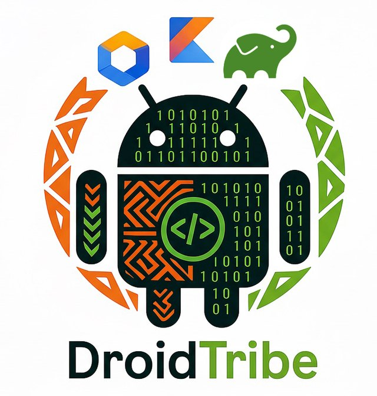

<p align="center">
  
</p>

<h1 align="center">DroidTribe</h1>

<p align="center">
  An Android developer community that meets in Pune, Bengaluru and Mumbai.<br />
  <a href="https://droidtribe.github.io">droidtribe.github.io</a>
</p>

---

DroidTribe runs free, community-led meetups for Android developers. This is the
website behind them: an archive of every meetup so far — the talks, who gave
them, photos from the day, and links to the recordings.

## What's here

| Path                  | What it is                                          |
| --------------------- | --------------------------------------------------- |
| `index.html`          | The site — hero, organisers, and the meetup archive |
| `data/`               | The content: site details, organisers, meetups      |
| `css/`                | Styles, one file per area of the page               |
| `js/`                 | Behaviour, one file per feature                     |
| `assets/`             | Fonts and images, grouped by what they belong to    |
| `support/`            | Contact, privacy policy, terms of service           |
| `docs/maintaining.md` | How to update the site                              |

No build step, no dependencies, no framework — plain HTML, CSS and JavaScript,
with every font and image served from this repository.

## Running it locally

Serve the folder over HTTP so relative paths behave exactly as they do in
production:

```bash
python3 -m http.server 4180
```

Then open `http://localhost:4180`.

## Design

Every colour, space, radius and easing comes from custom properties in
`css/tokens.css`, with a full palette for light and another for dark. Nothing
else hardcodes a colour, so retheming the site means editing one file. The
switcher in the footer remembers each visitor's choice and defaults to dark.

## Contributing

Spotted a wrong talk title, a broken link, or a photo you would rather not be
in? Open an issue or email
[droidtribecommunity@gmail.com](mailto:droidtribecommunity@gmail.com) — photo
removal requests need no explanation.

Adding a meetup, a speaker or an organiser is documented in
[docs/maintaining.md](docs/maintaining.md).
